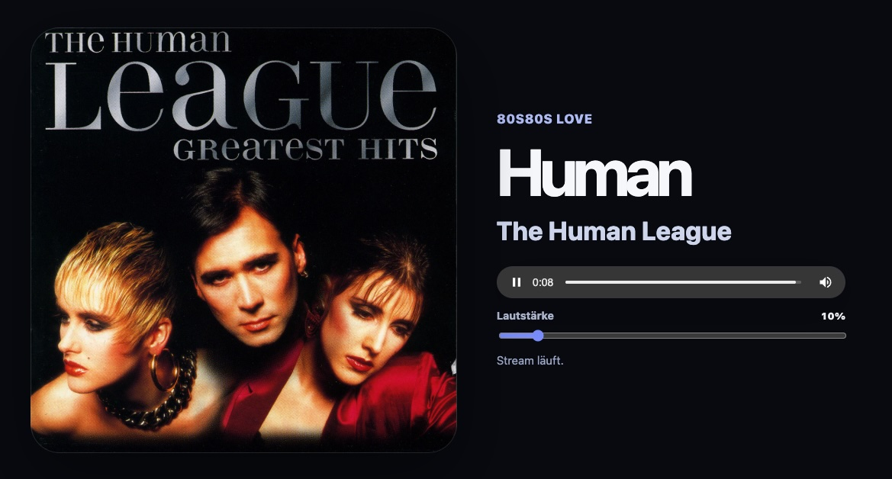
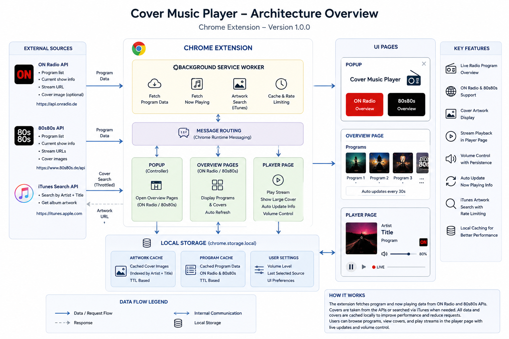
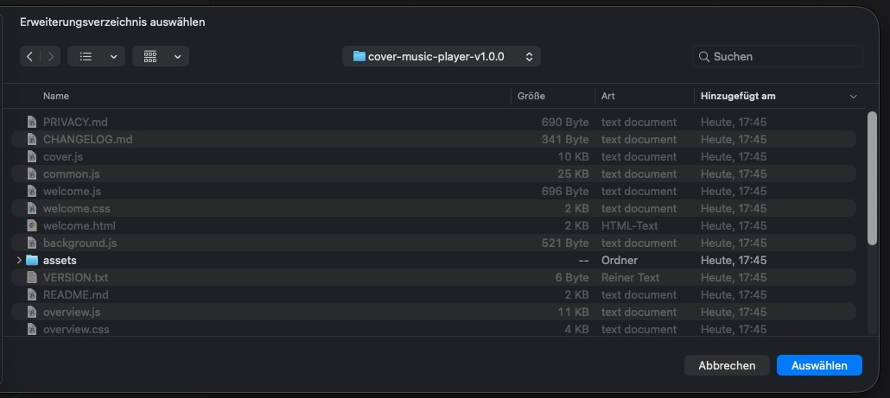
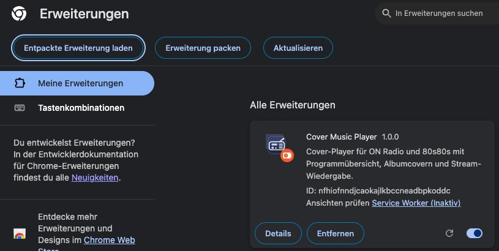
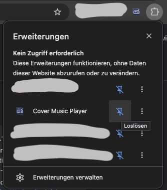
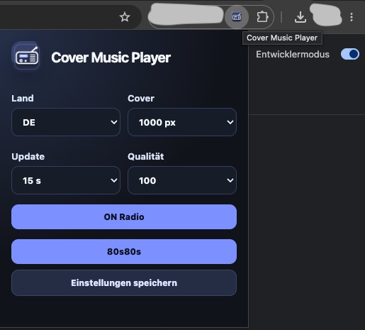
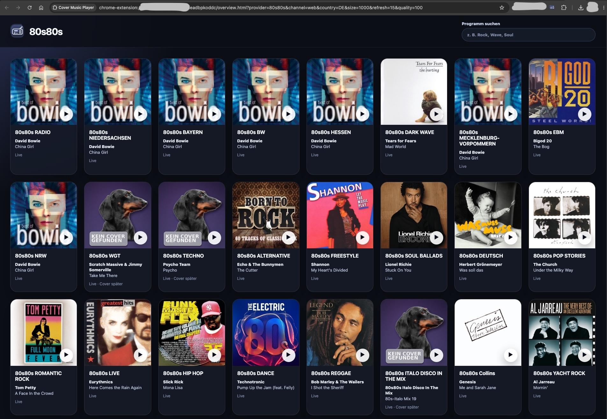
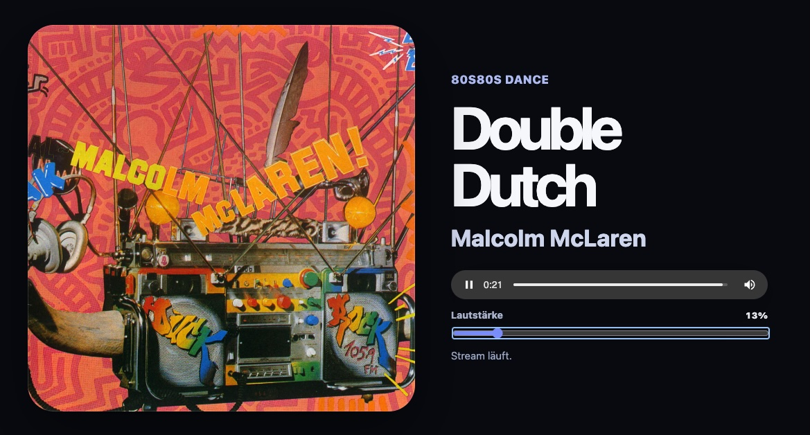

# Cover Music Player



Chrome-Erweiterung für ON Radio und 80s80s. Die Erweiterung zeigt Programmübersichten mit Albumcovern und öffnet per Klick einen Player-Tab mit großem Cover, Stream-Wiedergabe und Lautstärkeregler.

**Cover Music Player** is a Chrome extension that displays live radio cover artwork and plays streams in a dedicated player tab.

Version **1.0.0** includes:

* ON Radio program overview
* 80s80s program overview
* Clickable cover tiles
* Player tab with large cover artwork
* Integrated audio stream playback
* Volume control with saved volume setting
* Automatic title and cover updates
* Fallback image when no cover is available
* Local cover caching and throttled artwork requests

<br>
<a href="https://www.buymeacoffee.com/thoralf.brandt" target="_blank">
  
</a>
<br>

## Funktionen

- Popup mit zwei Startpunkten: **ON Radio** und **80s80s**
- Eigene Übersichtsseite pro Anbieter
- Klick auf ein Cover öffnet den Player-Tab
- Player mit großem Cover, Titel, Artist, Stream und Lautstärkeregler
- Kleine Vorschau-Cover in der Übersicht, große Cover im Player
- Lokales Fallback-Bild, wenn kein Cover gefunden wird
- Lokaler Cache für Cover-Suchen
- Gedrosselte iTunes-Abfragen für ON Radio
- Direkte Cover- und Streamdaten aus der 80s80s-API
- Korrektur typischer Umlaut-/Encoding-Fehler
- Einmalige Hilfeseite zum Anheften des Extension-Symbols



## Installation in Chrome

1. Release aus dem Ordner herunterladen und enpacken oder Repository herunterladen oder klonen.
2. Chrome öffnen und `chrome://extensions` aufrufen.
3. Entwicklermodus aktivieren.
4. **Entpackte Erweiterung laden** anklicken.
5. Den Ordner dieses Repositorys auswählen.
6. Das Radio-Symbol über das Puzzle-Menü anheften.













## Datenquellen

### ON Radio

- Now-Playing-Daten und Stream-URLs: `https://www.0nradio.com/now_playing/<slug>.json`
- Cover-Suche: iTunes Search API
- Cover-Bilder: Apple `mzstatic.com`

### 80s80s

- Programmliste, Titel, Cover und Stream-URLs: `https://www.80s80s.de/streams/api`

## Datenschutz

Die Erweiterung benötigt keinen eigenen Server und überträgt keine persönlichen Daten an den Entwickler. Es werden nur die für die Funktion benötigten Daten von ON Radio, 80s80s und der iTunes Search API geladen. Einstellungen, Lautstärke und Cover-Cache werden lokal im Chrome-Speicher abgelegt.

## Repository-Struktur

```text
manifest.json       Chrome Manifest V3
popup.*             Popup mit Anbieter-Buttons und Einstellungen
overview.*          Programmübersichten mit Cover-Kacheln
cover.*             Player-Tab mit Cover, Stream und Lautstärke
channels.js         ON-Radio-Programmliste und Provider-Konfiguration
common.js           Gemeinsame Funktionen für Datenabruf, Cover und Encoding
background.js       Einmalige Startseite nach Installation oder Update
welcome.*           Hilfeseite zum Anheften der Extension
icons/              Extension-Icons
assets/             Fallback-Bild für fehlende Cover
```

## Release bauen

```bash
zip -r cover-music-player-v1.0.0.zip . -x "*.git*" -x "*.DS_Store" -x "*.zip"
```

## Version

Aktuelle Version: **1.0.0**
